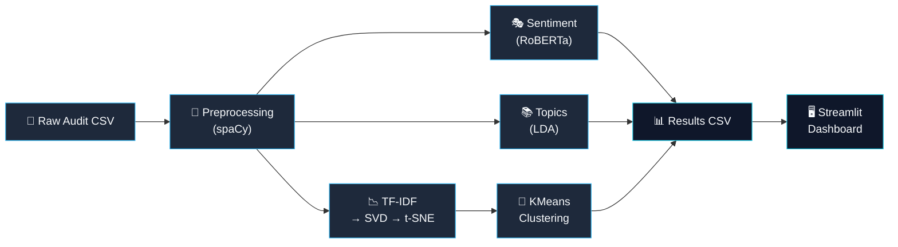
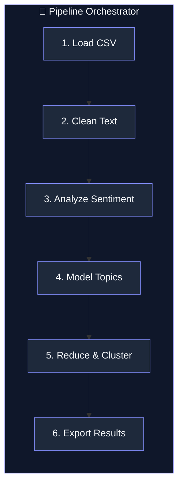

#

# Audit Insight

**Advanced NLP Analytics for Audits — Transform unstructured audit text into structured, actionable insights.**


Audit Insight is an end-to-end NLP pipeline that ingests raw audit observations, findings, and recommendations — then automatically classifies sentiment, discovers latent topics, and clusters similar documents for rapid triage. Built for teams that need to surface risk patterns from thousands of audit texts in minutes, not weeks.

---

## ✨ Key Features

| | Feature | Description |
|:-:|---------|-------------|
| 🧹 | **Intelligent Preprocessing** | spaCy-powered tokenization, lemmatization, and stop-word removal |
| 🎭 | **Sentiment Classification** | RoBERTa transformer model with confidence scores (positive / neutral / negative) |
| 📚 | **Topic Discovery** | Gensim LDA uncovers recurring themes across audit documents |
| 📉 | **Dimensionality Reduction** | TF-IDF → SVD → t-SNE projects documents into explorable 2D space |
| 🔬 | **Document Clustering** | KMeans groups similar findings for efficient batch review |
| 📊 | **Interactive Dashboard** | Streamlit web UI with upload, real-time analysis, and CSV export |
| ⚡ | **CLI-First Design** | Full pipeline accessible from a single terminal command |
| 🧪 | **Tested & CI-Ready** | pytest suite with GitHub Actions continuous integration |

---

## 🏗️ Architecture





---

## 🚀 Quick Start

### 1. Clone the Repository

```bash
git clone https://github.com/Harshaaalll/audit-insight.git
cd audit-insight
```

### 2. Create a Virtual Environment

```bash
python -m venv venv
source venv/bin/activate        # Linux / macOS
venv\Scripts\activate           # Windows
```

### 3. Install Dependencies

```bash
pip install -r requirements.txt
python -m spacy download en_core_web_sm
```

### 4. Run the Pipeline (CLI)

```bash
python -m audit_insight --input data/sample_run_doc.csv --output data/results.csv
```

### 5. Launch the Dashboard

```bash
streamlit run audit_insight/app/streamlit_app.py
```

> **Tip:** Use the included `data/sample_docs.csv` (4 rows) for a quick smoke test, or `data/sample_run_doc.csv` (100 rows) for a full demo.

---

## 💻 CLI Reference

```bash
python -m audit_insight [OPTIONS]
```

| Option | Type | Default | Description |
|--------|------|---------|-------------|
| `--input` | `PATH` | *required* | Path to the input CSV file |
| `--output` | `PATH` | `results.csv` | Path for the output CSV file |
| `--text-col` | `STR` | `text` | Name of the column containing audit text |
| `--num-topics` | `INT` | `6` | Number of LDA topics to discover |
| `--num-clusters` | `INT` | `5` | Number of KMeans clusters |

**Examples:**

```bash
# Quick test with 4-row sample
python -m audit_insight --input data/sample_docs.csv --output quick_results.csv

# Full run with custom parameters
python -m audit_insight \
    --input data/sample_run_doc.csv \
    --output data/results.csv \
    --text-col text \
    --num-topics 8 \
    --num-clusters 4

# Launch Streamlit dashboard
streamlit run audit_insight/app/streamlit_app.py
```

---

## 📊 Sample Output

After running the pipeline, the output CSV contains these enriched columns:

| text | cleaned_text | sentiment_label | sentiment_score | topic_id | topic_prob | tsne_x | tsne_y | cluster_label |
|------|-------------|-----------------|-----------------|----------|------------|--------|--------|---------------|
| Segregation of duties not enforced in AP workflow | segregation duty enforce ap workflow | negative | 0.87 | 2 | 0.64 | -12.4 | 8.7 | 0 |
| All reconciliations completed on time this quarter | reconciliation complete time quarter | positive | 0.92 | 0 | 0.71 | 5.1 | -3.2 | 3 |
| Management acknowledges the finding and will review | management acknowledge finding review | neutral | 0.68 | 4 | 0.55 | 1.8 | 0.4 | 1 |
| Expired vendor contracts still active in system | expire vendor contract active system | negative | 0.79 | 1 | 0.62 | -8.3 | 11.2 | 0 |
| Internal controls operating effectively across units | internal control operate effectively unit | positive | 0.91 | 3 | 0.73 | 7.6 | -5.8 | 3 |

> For comprehensive sample results including topic keywords and cluster analysis, see [docs/sample_results.md](docs/sample_results.md).

---

## ⚙️ Configuration

All hyperparameters are centralized in `audit_insight/config.py`:

| Parameter | Default | Description |
|-----------|---------|-------------|
| `SPACY_MODEL` | `en_core_web_sm` | spaCy language model for preprocessing |
| `ROBERTA_MODEL` | `cardiffnlp/twitter-roberta-base-sentiment` | HuggingFace transformer for sentiment |
| `NUM_TOPICS` | `6` | Number of LDA topics to extract |
| `LDA_PASSES` | `10` | Number of training passes over the corpus |
| `TSNE_PERPLEXITY` | `30` | t-SNE perplexity (balance local vs. global structure) |
| `N_CLUSTERS` | `5` | Number of KMeans clusters |
| `MAX_FEATURES` | `5000` | Maximum TF-IDF vocabulary size |
| `SVD_COMPONENTS` | `50` | Number of SVD dimensions before t-SNE |

Override at runtime via CLI flags (`--num-topics`, `--num-clusters`) or by editing `config.py` directly.

---

## 🛠️ Tech Stack

| Technology | Version | Purpose |
|------------|---------|---------|
| **Python** | 3.9+ | Core runtime |
| **spaCy** | 3.x | Tokenization, lemmatization, stop-word removal |
| **HuggingFace Transformers** | 4.x | RoBERTa sentiment classification |
| **Gensim** | 4.x | LDA topic modeling |
| **scikit-learn** | 1.x | TF-IDF, SVD, t-SNE, KMeans |
| **Streamlit** | 1.x | Interactive web dashboard |
| **pandas** | 2.x | Data manipulation and CSV I/O |
| **pytest** | 8.x | Unit testing framework |
| **GitHub Actions** | — | Continuous integration |
| **Ruff** | — | Linting and code formatting |

---

## 📁 Project Structure

```
audit-insight/
│
├── audit_insight/                # Main Python package
│   ├── __init__.py               # Package metadata & version
│   ├── __main__.py               # CLI entry point (argparse)
│   ├── config.py                 # Centralized hyperparameters
│   ├── preprocessing.py          # spaCy text cleaning pipeline
│   ├── sentiment.py              # RoBERTa sentiment analysis
│   ├── topics.py                 # Gensim LDA topic modeling
│   ├── clustering.py             # TF-IDF → SVD → t-SNE → KMeans
│   ├── pipeline.py               # End-to-end orchestrator
│   ├── utils.py                  # CSV I/O & result assembly
│   └── app/
│       ├── __init__.py
│       ├── streamlit_app.py      # Streamlit dashboard UI
│       └── launcher.py           # Desktop launcher utility
│
├── tests/                        # Test suite
│   ├── test_preprocessing.py     # Preprocessing unit tests
│   ├── test_utils.py             # Utility function tests
│   ├── test_sentiment.py         # Sentiment model tests
│   ├── test_clustering.py        # Clustering pipeline tests
│   └── test_topics.py            # Topic modeling tests
│
├── data/                         # Sample datasets
│   ├── sample_docs.csv           # 4-row quick test
│   └── sample_run_doc.csv        # 100-row demo dataset
│
├── docs/                         # Documentation
│   ├── architecture.md           # System design & data flow
│   ├── overview.md               # High-level project overview
│   ├── installation.md           # Setup & installation guide
│   ├── sample_results.md         # Example outputs & analysis
│   └── troubleshooting.md        # Common issues & fixes
│
├── assets/                       # Static assets
│   └── banner.png                # Repository banner image
│
├── .github/workflows/ci.yml      # GitHub Actions CI pipeline
├── pyproject.toml                 # Project metadata & build config
├── requirements.txt               # Python dependencies
├── CONTRIBUTING.md                 # Contribution guidelines
├── LICENSE                         # MIT License
└── .gitignore                      # Git ignore rules
```

---

## 🧪 Testing

Run the full test suite with pytest:

```bash
pytest tests/ -v
```

**What's tested:**

| Module | Tests Cover |
|--------|-------------|
| `preprocessing.py` | Tokenization, lemmatization, stop-word removal, edge cases |
| `sentiment.py` | Label accuracy, confidence score ranges, batch processing |
| `topics.py` | Topic count validation, keyword extraction, reproducibility |
| `clustering.py` | Cluster assignment, t-SNE output dimensions, feature counts |
| `utils.py` | CSV reading/writing, column validation, error handling |

```bash
# Run with coverage report
pytest tests/ -v --cov=audit_insight --cov-report=term-missing
```

---

## 🗺️ Roadmap

Planned enhancements for future releases:

| Priority | Feature | Description |
|:--------:|---------|-------------|
| 🔴 | **UMAP Replacement** | Replace t-SNE with UMAP for faster, more scalable embeddings |
| 🔴 | **NER Integration** | Extract named entities (amounts, dates, departments) from findings |
| 🟡 | **Domain Dictionaries** | Custom audit/finance vocabulary for improved preprocessing |
| 🟡 | **PDF & Word Input** | Accept `.pdf` and `.docx` files directly |
| 🟢 | **Docker Support** | Containerized deployment with Docker Compose |
| 🟢 | **REST API** | FastAPI endpoint for programmatic access |

---

## 🤝 Contributing

Contributions are welcome! Please read the [Contributing Guidelines](CONTRIBUTING.md) before submitting a pull request.

1. Fork the repository
2. Create a feature branch (`git checkout -b feature/amazing-feature`)
3. Commit your changes (`git commit -m 'Add amazing feature'`)
4. Push to the branch (`git push origin feature/amazing-feature`)
5. Open a Pull Request

---

## 📄 License

This project is licensed under the **MIT License** — see the [LICENSE](LICENSE) file for details.

---

## 👤 Author

**Harshal Bhambhani**

[](https://github.com/Harshaaalll)

---

<p align="center">
  <sub>Built with 🧠 and ☕ — If this project helped you, consider giving it a ⭐</sub>
</p>
