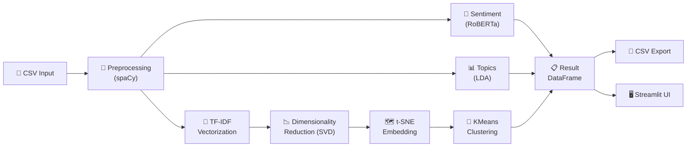

# 🏗️ Architecture — Audit Insight

This document describes the end-to-end pipeline architecture of **Audit Insight**, detailing how unstructured audit text is transformed into structured, actionable insights.

---

## Pipeline Overview



---

## Stage-by-Stage Breakdown

### 1. 📄 CSV Input

The pipeline accepts CSV files containing a text column with raw audit narratives — observations, findings, recommendations, or compliance notes.

### 2. 🔧 Preprocessing (spaCy)

Using the `en_core_web_sm` model, the preprocessing stage:

- **Tokenizes** raw text into individual tokens
- **Lemmatizes** words to their base forms (e.g., "reviewed" → "review")
- **Removes stop words** and punctuation to reduce noise
- Produces a cleaned text column ready for downstream analysis

### 3. 💬 Sentiment Analysis (RoBERTa)

Each document is classified using the `cardiffnlp/twitter-roberta-base-sentiment` transformer model from HuggingFace:

| Label | Meaning |
|-------|---------|
| **Positive** | Favorable findings, compliant observations |
| **Neutral** | Informational or procedural text |
| **Negative** | Non-compliance, risks, control deficiencies |

The model outputs a polarity label and a confidence score (0–1).

### 4. 📊 Topic Modeling (Gensim LDA)

Latent Dirichlet Allocation discovers **recurring themes** across the audit corpus:

- Documents are converted to bag-of-words representations
- LDA extracts *k* topics (configurable, default = 5)
- Each topic is represented by its top keywords
- Every document is assigned to its dominant topic

### 5. 🔢 TF-IDF Vectorization

Cleaned text is transformed into a numerical **TF-IDF matrix** using scikit-learn's `TfidfVectorizer`. This captures term importance relative to the corpus, enabling mathematical comparison of documents.

### 6. 📉 Dimensionality Reduction (Truncated SVD)

The high-dimensional TF-IDF matrix is reduced via **Truncated SVD** (similar to LSA) to a lower-dimensional space (default: 50 components). This step:

- Reduces computational cost
- Removes noise from sparse features
- Prepares data for t-SNE embedding

### 7. 🗺️ t-SNE Embedding

**t-SNE** (t-distributed Stochastic Neighbor Embedding) projects the SVD-reduced vectors into 2D space, preserving local neighborhood structure. The result is a set of (x, y) coordinates suitable for scatter-plot visualization.

### 8. 🎯 KMeans Clustering

**KMeans** groups the t-SNE embeddings into *k* clusters (configurable). Each document receives a cluster label, enabling:

- Visual cluster boundaries on scatter plots
- Group-level analysis of audit findings
- Automatic categorization of similar observations

### 9. 📋 Result DataFrame

All outputs are merged into a unified Pandas DataFrame:

| Column | Source |
|--------|--------|
| `original_text` | Input |
| `cleaned_text` | Preprocessing |
| `sentiment` | RoBERTa |
| `sentiment_score` | RoBERTa |
| `dominant_topic` | LDA |
| `topic_keywords` | LDA |
| `cluster` | KMeans |
| `tsne_x`, `tsne_y` | t-SNE |

### 10. 💾 CSV Export & 🖥️ Streamlit UI

The result DataFrame can be:

- **Exported** as a CSV file for integration with BI tools, Excel, or databases
- **Explored interactively** through the Streamlit web dashboard, which provides filters, charts, and download capabilities

---

## Data Flow Summary

```
Raw CSV → spaCy Cleaning → [Sentiment | Topics | TF-IDF → SVD → t-SNE → KMeans] → Merged DataFrame → Export / UI
```

The pipeline is designed to be **modular** — each stage can be run independently or swapped for alternative implementations (e.g., replacing t-SNE with UMAP).
