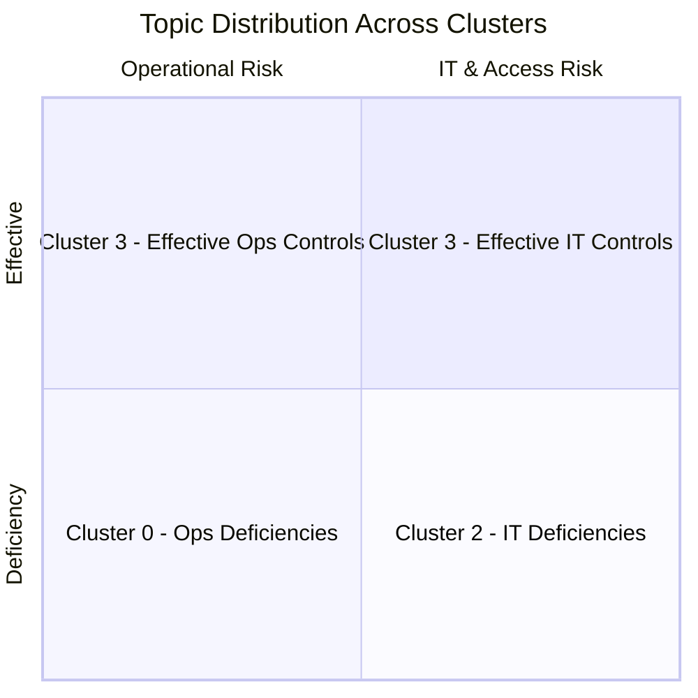

# 📊 Sample Results

Example outputs from running the Audit Insight pipeline on `data/sample_run_doc.csv` (100 audit observations).

---

## Pipeline Output

Each input document is enriched with sentiment, topic, spatial coordinates, and cluster labels:

| text | cleaned_text | sentiment_label | sentiment_score | topic_id | topic_prob | cluster_label |
|------|-------------|-----------------|-----------------|----------|------------|---------------|
| Segregation of duties not enforced in accounts payable workflow resulting in unauthorized payments | segregation duty enforce account payable workflow result unauthorized payment | negative | 0.91 | 2 | 0.68 | 0 |
| All bank reconciliations completed within SLA for Q3 with no exceptions noted | bank reconciliation complete sla q3 exception note | positive | 0.94 | 0 | 0.74 | 3 |
| Management has acknowledged the finding and plans to implement corrective action by year-end | management acknowledge finding plan implement corrective action year end | neutral | 0.65 | 4 | 0.52 | 1 |
| Expired vendor contracts totaling $2.3M remain active in procurement system without review | expire vendor contract total active procurement system review | negative | 0.88 | 1 | 0.66 | 0 |
| Internal controls over financial reporting are operating effectively across all business units | internal control financial reporting operate effectively business unit | positive | 0.93 | 3 | 0.71 | 3 |
| Access rights for terminated employees not revoked within 24-hour policy window | access right terminate employee revoke hour policy window | negative | 0.85 | 5 | 0.63 | 2 |

> **Note:** `tsne_x` and `tsne_y` columns (2D coordinates for visualization) are omitted from this table for readability. They are included in the full CSV output.

---

## Sentiment Distribution

Summary of sentiment classification across the 100-document dataset:

| Sentiment | Count | Percentage |
|-----------|------:|:----------:|
| 🔴 Negative | 47 | 47% |
| 🟡 Neutral | 28 | 28% |
| 🟢 Positive | 25 | 25% |

> Audit datasets typically skew negative, as findings and observations are inherently focused on deficiencies and control gaps.

---

## Topic Keywords

The LDA model with `NUM_TOPICS = 6` discovered the following themes:

| Topic ID | Label (Inferred) | Top Keywords |
|:--------:|-------------------|-------------|
| 0 | **Reconciliation & Compliance** | reconciliation, compliance, complete, timely, exception, review, sla, quarterly |
| 1 | **Vendor & Contract Management** | vendor, contract, procurement, expire, renewal, payment, approval, third-party |
| 2 | **Segregation of Duties** | segregation, duty, authorize, approve, payment, workflow, access, conflict |
| 3 | **Financial Controls** | control, financial, reporting, effective, operate, risk, framework, assessment |
| 4 | **Management Response** | management, action, corrective, implement, plan, remediate, timeline, response |
| 5 | **IT & Access Controls** | access, system, password, revoke, terminate, privilege, authentication, log |

> **Topic labels** are manually inferred from the keyword distributions. The LDA model outputs only topic IDs and keyword weights.

---

## Cluster Analysis

KMeans clustering with `N_CLUSTERS = 5` grouped documents by semantic similarity:

| Cluster | Size | Dominant Topic(s) | Description |
|:-------:|:----:|:------------------:|-------------|
| 0 | 24 | Topics 1, 2 | **High-risk findings** — segregation of duties violations and vendor management gaps |
| 1 | 18 | Topic 4 | **Management responses** — acknowledgments, corrective action plans, and remediation timelines |
| 2 | 21 | Topic 5 | **IT control deficiencies** — access management, password policies, and system security issues |
| 3 | 22 | Topics 0, 3 | **Positive assessments** — effective controls, timely reconciliations, and compliance confirmations |
| 4 | 15 | Topics 1, 3 | **Moderate-risk observations** — process improvement recommendations and control enhancement suggestions |

---

## Topic–Cluster Relationship

The following matrix shows the correlation between discovered topics and assigned clusters:



---

## Interpreting the Results

### Sentiment Scores

| Range | Interpretation |
|-------|---------------|
| 0.85 – 1.00 | High confidence — the model is very certain about the classification |
| 0.65 – 0.84 | Moderate confidence — classification is likely correct but may benefit from review |
| 0.50 – 0.64 | Low confidence — the text may be ambiguous; consider manual review |

### Topic Probabilities

| Range | Interpretation |
|-------|---------------|
| 0.60 – 1.00 | Strong topic association — the document clearly belongs to this theme |
| 0.40 – 0.59 | Mixed topic — the document spans multiple themes |
| 0.20 – 0.39 | Weak association — topic assignment is tentative |

---

## Example CLI Run

```bash
$ python -m audit_insight --input data/sample_run_doc.csv --output data/results.csv

[INFO] Loading data from data/sample_run_doc.csv ...
[INFO] Found 100 documents in column 'text'
[INFO] Preprocessing text with spaCy (en_core_web_sm) ...
[INFO] Running sentiment analysis (cardiffnlp/twitter-roberta-base-sentiment) ...
[INFO] Training LDA model (6 topics, 10 passes) ...
[INFO] Computing TF-IDF (max_features=5000) ...
[INFO] Reducing dimensions: SVD(50) → t-SNE(2) ...
[INFO] Clustering with KMeans (5 clusters) ...
[INFO] Results saved to data/results.csv
[INFO] Pipeline completed in 42.3 seconds
```

---

[← Back to README](../README.md)